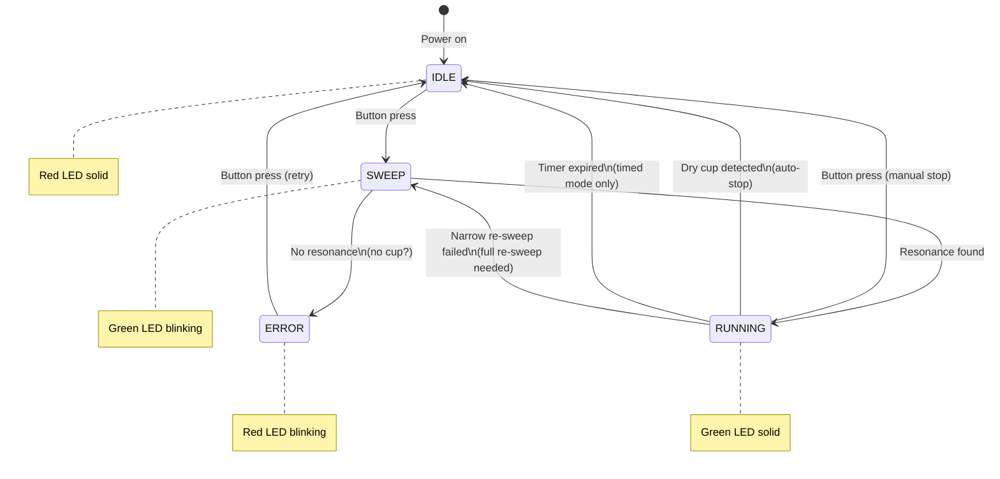
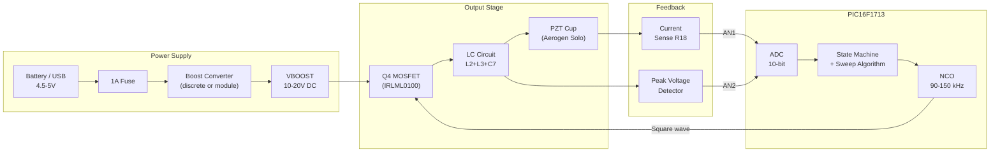
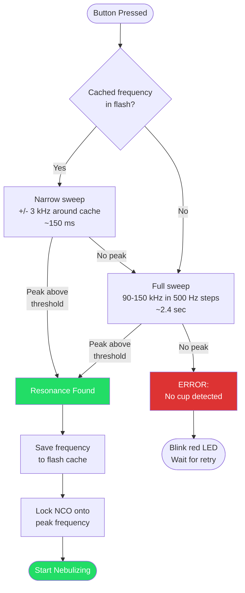
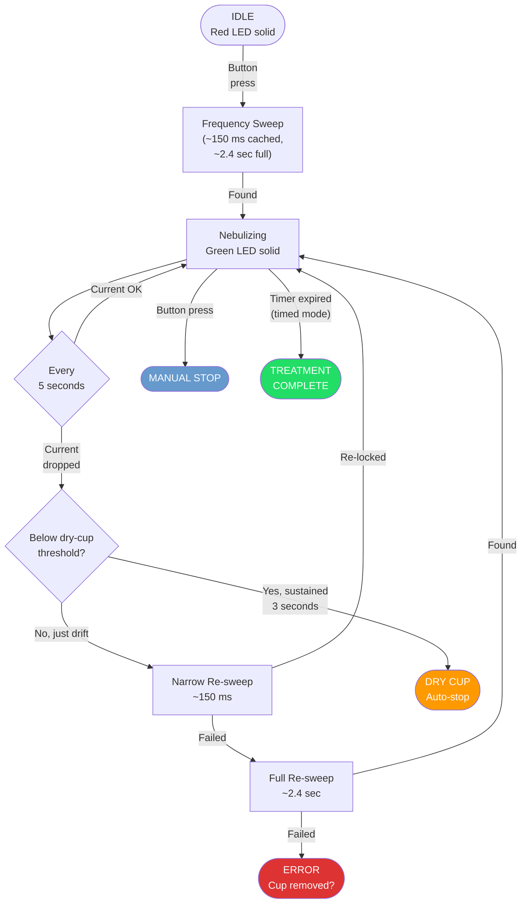
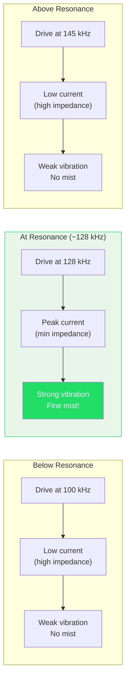
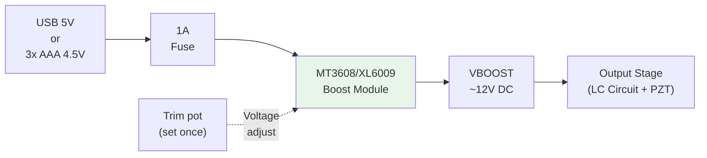
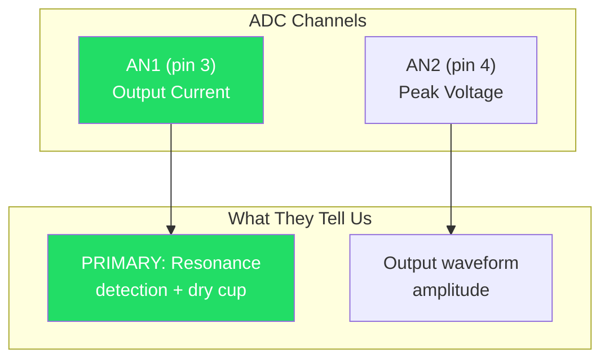
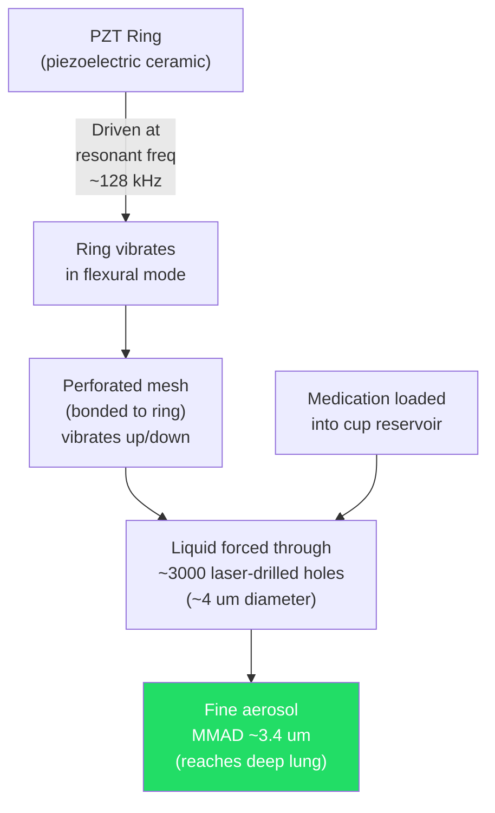

# Controller Design Diagrams

Visual guides to how the vibrating mesh nebulizer controller works. These diagrams render automatically on GitHub.

---

## Controller State Machine

How the controller moves between states from power-on to nebulization:

---

## Circuit Block Diagram

How power and signals flow through the controller:

---

## Frequency Sweep Algorithm

How the controller finds the PZT's resonant frequency:

---

## Treatment Session Flow

What happens during a complete nebulization session:

---

## Resonance Detection Concept

Why the frequency sweep works — the PZT draws maximum current at its resonant frequency:

---

## Power Path

How the boost module provides high-voltage DC to the output stage:

---

## ADC Feedback Signals

What the MCU measures during operation:

**AN1 (output current) is the most important signal.** It's how the controller finds resonance, tracks resonance drift, and detects a dry cup. The sweep algorithm measures this at each frequency step — the frequency with the highest AN1 reading is the resonant frequency. (AN0 and AN3 are used only in discrete boost mode and are unused in the turnkey build.)

---

## Mechanical: What Happens Inside the Cup

The two exposed contacts on the Aerogen Solo cup connect directly to the PZT ring. There's no polarity — it's an AC device. The controller's job is simply to generate the right frequency and voltage to make the ring vibrate optimally.
